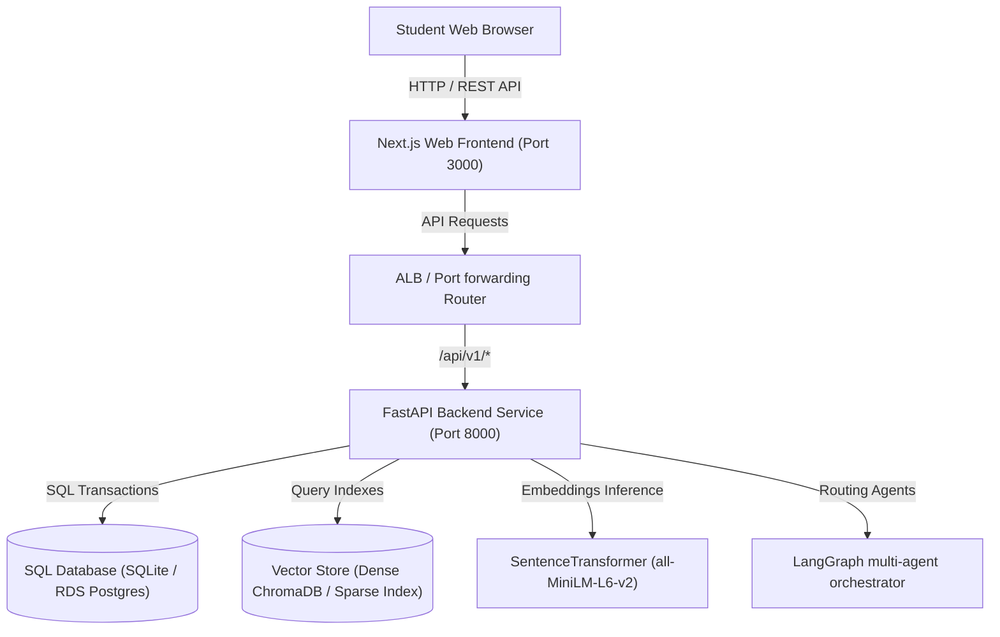
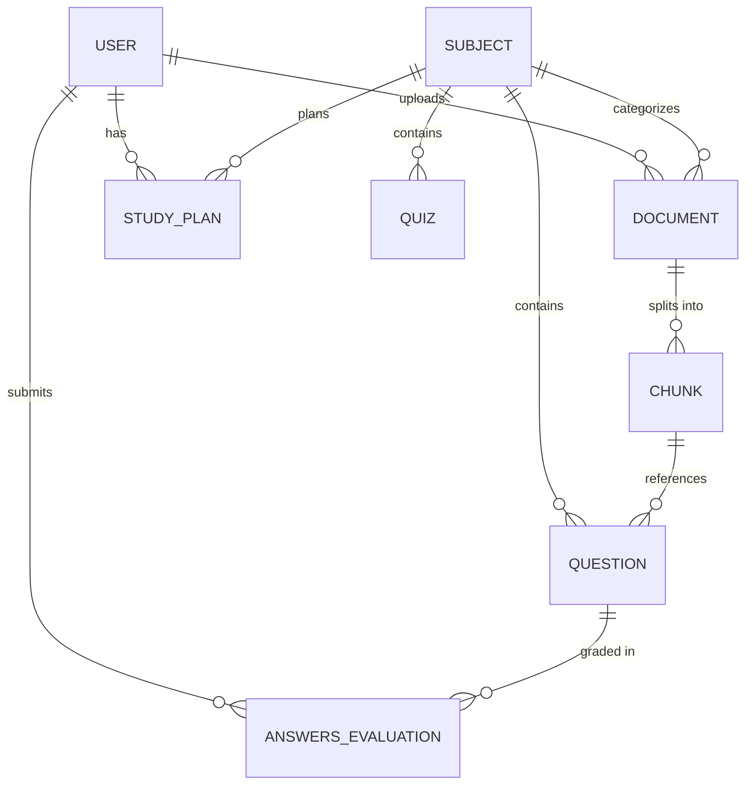

# EduGenAI (ExamGPT) Platform Specification Manual

EduGenAI is an AI-powered academic learning, schedule tracking, and practice evaluation portal designed for Savitribai Phule Pune University (SPPU) engineering courses.

---

## 1. System Overview
EduGenAI provides student-centric exam preparation components:
- **Course Subject Vaults**: Segmented learning environments grouped by Branch, Semester, and Subject.
- **Bi-Encoder Ingestion Pipeline**: Layout-aware text extraction and semantic sentence chunking.
- **RAG-Grounded Chat Assistant**: Context-backed chat conversations referencing slide pages.
- **Personalized Planner**: Timeline calendars partitioned automatically over detected syllabus units.
- **Dynamic Quiz Generator**: Practice MCQ worksheets that sanitize answers to prevent cheating.
- **Essay Answer Evaluator**: Checks student responses against reference notes, scoring estimated marks.
- **Performance Analytics**: Dashboards identifying weak course units.

---

## 2. System Architecture

### 2.1 Block Architecture


### 2.2 LangGraph Multi-Agent Orchestration
The chatbot routing logic utilizes a collaborative multi-agent workflow:
- **Supervisor Node**: Parses user intents and forwards requests to specialized executors.
- **Study Planner Agent**: Generates calendars dividing syllabus items.
- **Exam Predictor Agent**: Identifies high-frequency questions.
- **Answer Evaluator Agent**: Scores long-form essays.
- **Quiz Generator Agent**: Creates MCQ practices.

---

## 3. Database Schema Design

### 3.1 Entity Relationship Diagram


### 3.2 Relational Model Glossary
1. **User**: Standard identity rows (Email, hashed password, role, branch, semester).
2. **Subject**: Course units index (Code, name, semester, branch).
3. **Document**: Uploaded file metadata (Name, storage path, category).
4. **Chunk**: Parsed sliding text units carrying `unit_tag` and embeddings mapping vector indexes.
5. **Question**: Exams question banks carrying occurrences counts and marks weight.
6. **StudyPlan**: Schedules carry progression checkpoints and overall completion rate weights.
7. **Quiz**: MCQs and worksheets stripping answers during practice runs.
8. **AnswersEvaluation**: Essay feedbacks calculating scores and improvement points.

---

## 4. REST API Endpoint Registry

| Protocol | Route | Access | Description |
|---|---|---|---|
| **POST** | `/api/v1/auth/register` | Public | Registers a student. Demands `@sppu.edu.in` domain. |
| **POST** | `/api/v1/auth/login` | Public | Validates credentials and returns JWT token. |
| **GET** | `/api/v1/auth/me` | Authorized | Returns current logged-in identity card. |
| **POST** | `/api/v1/documents/upload/{subject_id}` | Authorized | Uploads a note file to index vector schemas. |
| **GET** | `/api/v1/documents/subject/{subject_id}` | Public | Lists all ingested documents. |
| **POST** | `/api/v1/chats/sessions` | Authorized | Creates conversational session workspace. |
| **POST** | `/api/v1/chats/sessions/{session_id}/query` | Authorized | Submits query, returning citations context. |
| **POST** | `/api/v1/study-plans/` | Authorized | Generates custom syllabus study plan. |
| **PUT** | `/api/v1/study-plans/{plan_id}/checkpoint` | Authorized | Toggles checklist items, re-evaluating progress. |
| **POST** | `/api/v1/quizzes/` | Authorized | Creates a practice test based on syllabus. |
| **POST** | `/api/v1/quizzes/{quiz_id}/submit` | Public | Submits answers for option matching and scoring. |
| **POST** | `/api/v1/evaluations/` | Authorized | Submits essay answer for lexical grading. |
| **GET** | `/api/v1/analytics/subjects/{subject_id}` | Authorized | Returns study plan progress and weak unit flags. |

---

## 5. Local Runbook Guide

### 5.1 Backend Setup
1. Navigate to the backend directory:
   ```bash
   cd backend
   ```
2. Set up virtual environment and install dependency libraries:
   ```bash
   python -m venv venv
   venv\Scripts\activate
   pip install -r requirements.txt
   ```
3. Initialize the database and run migrations:
   ```bash
   alembic upgrade head
   ```
4. Start FastAPI server:
   ```bash
   uvicorn app.main:app --reload --host 127.0.0.1 --port 8000
   ```

### 5.2 Frontend Setup
1. Navigate to the frontend directory:
   ```bash
   cd frontend
   ```
2. Install npm dependencies:
   ```bash
   npm install
   ```
3. Build the NextJS application:
   ```bash
   npm run build
   ```
4. Run in dev environment:
   ```bash
   npm run dev
   ```

### 5.3 Test Suite Executions
- In the backend directory:
  ```bash
  venv\Scripts\python.exe tests/run_tests.py
  ```

---

## 6. Docker Container Orchestration
Run the entire platform (FastAPI + NextJS + Volumes) using a single command:
```bash
docker compose up --build
```
- Access Frontend Client: `http://localhost:3000`
- Access Backend API Docs (Swagger): `http://localhost:8000/docs`
